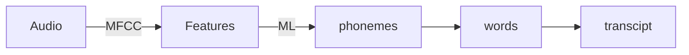
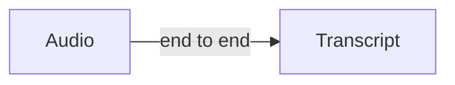

## Carrying out error analysis

Should you try to make a cat classifier do better on dogs?

Error analysis:

-  Get ~100 mislabeled dev set examples
-  Count up how many are dogs and figure out how much can we actually improve on it.

Evaluate multiple ideas in parallel:

- Fix pictures of dogs being recognized as cats
- Fix great cats (lion, panthers,etc..)being misrecognized.
- Improve performance on blurry images.

Using a spreadsheet to tell the distribution of such mislabeled images.

So we can easily set up developing priority.

## Cleaning up the incorrectly labeled data

- DL algorithm are quite robust to random errors in the training set.

- If the error is random, it is okay to just leave them be. As long as the total  data size is large enough.

- It is less robust systematic error. (eg, consistently mark white cat as dog)
- Adding incorrect labeled into the spreadsheet of error analysis is a good way. By doing that we count up the fraction that mislabeled data occupied. 

We take a look a three values:

1. Overall dev set error
2. Errors due to incorrect labels
3. Errors due to other causes

Goal of the dev set is to help you select between two classifier A&B, but according to the fraction of mislabeled data, we cannot trust error standard on dev set.

Correcting incorrect dev/set set examples

- Apply same process to your dev and test set to make sure they continue to come from the same distribution 
- Consider examining examples your algorithm got right as well as ones it got wrong. If only fix those got wrong might add bias towards the model. But this is actually pretty hard to implement since the proportion of correct and incorrect data is different
- Train and dev/test set data may now come from slightly different distributions.

## Build your first system quickly and then iterate

How to choose which direction to work on.

Solution:

1. Set up dev/test set and metric
2. Build initial system quickly
3. Use bias variance analysis & error analysis to prioritize next steps.

## Training and testing on different distribution

Make sure that you dev/test set mainly focus on the target data distribution that you finally wants to deploy on.

The distribution in the training set and the dev/test set might need to be different according to that requirement.

## Bias and variance with mismatched data distribution

If your data distribution in the training set and dev set is different, you can no longer easily figure out why your model is generalize well. Since it could be problem in overfitting or it could just simply dose could not see data in the dev set due to the distribution.

Setting up a new sub-set called : training-dev which have the same distribution as training set but not used for training.

| Case\Error | Bayes | Training set | Training dev set | Dev Set | Problem                       |
| :--------- | ----- | ------------ | ---------------- | ------- | ----------------------------- |
| Case1      | 0%    | 1%           | 9%               | 10%     | Variance                      |
| Case2      | 0%    | 1%           | 1.5%             | 10%     | Data mismatch                 |
| Case3      | 0%    | 10%          | 11%              | 20%     | Avoidable Bias &Data mismatch |

If the different between training error and training dev set error is large, it means you are having a variance problem.

If the different between training error and training dev set error is small, it means you are having a mismatch problem.

If the different between training error and Bayes error and Dev set are both large, it means you are having both avoidable bias problem and data mismatch problem. 

## Addressing data mismatch problem

- Carry out manual error analysis to try to understand difference between training and dev/test set. v
- Make the training data more similar; or collect more data similar to dev/test set.
- Using some artificial data synthesis
- But it dose have some potential problem, like some noises that make no difference towards human hearing but actually recognized differently by machine.

## Transfer learning 

Using a trained image recognition network for some other purpose like radiology diagnosis.

- Change the last output layer, re-initialize the weight. and retrain
- If have enough data, you can just retrain all the weight in the neural network.
- Using other training set to retrain the early layers is called pre-training.
- Then training on the radiology data, that's call fine tuning.

Pre-training is helpful while you have plenty of data you want to transfer from and less date you want to transfer to. From a lot of data to little data.

- Task A and B have the same input X
- You have a lot more data for task A than task B
- Lower level features from A could be helpful for learning B

## Multi-task learning

We can actually train neural network that targeting different goal at the same time.

Like recognize  different object in the same picture. 

In order to to that we will create a new Loss function:

$new\ loss=\frac{1}{m}\sum_{i=1}^{m}\sum_{j=1}^{k}L(\hat y_j^i,y_j^i)$

$k$ is number of categories

And the $L(\hat y_j^i,y_j^i)$ is usually logistic loss $-y^{(i)}_jlog\hat y^{(i)}_j-(1-y^{(i)}_j)log(1-\hat y^{(i)}_j)$

This is unlike softmax regression, is that it is assigning an example to multiple labels. 

For the data set which dose not have full labels, we can only sum the value that J values only have been labeled.

#### When multi-task learning makes sense

- Training on a set of tasks that could benefit from having shared lower level features.
- Usually amount of data you have for each task is quiet similar.(This isn't always true.)
- Can train a big enough neural network to do well on all the task.

It was less used than transfer learning.

## End to end deep learning

Key idea is to replace multiple stages in the traditional stages with single neural network.

Using speech recognition example:

Traditionally: We have multiple stages like

End to end:

Most challenging part is that you need a lot of data for training before it works well.

## Whether to use end to end learning or not.

Pros and Cons:

Pro: 

- Let the date speak.

- Less hand-designing of components needed

Con:

- May need large amount of data
- Excludes potentially useful hand designed components.
- 